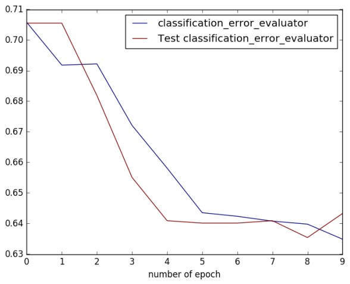
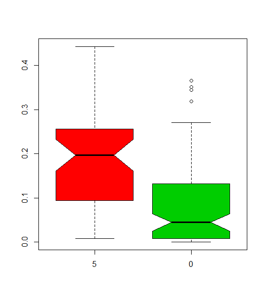
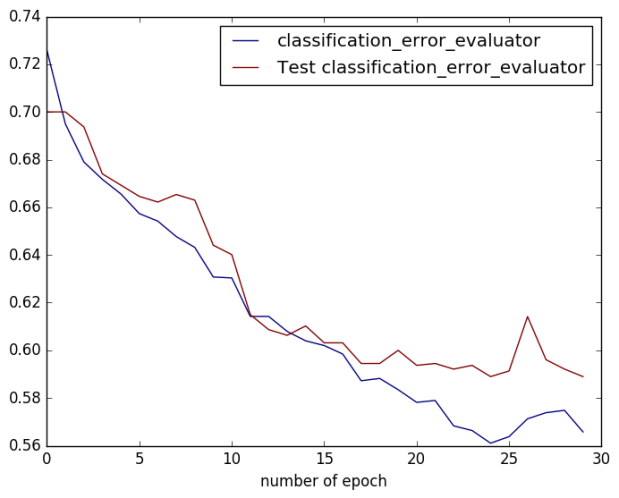
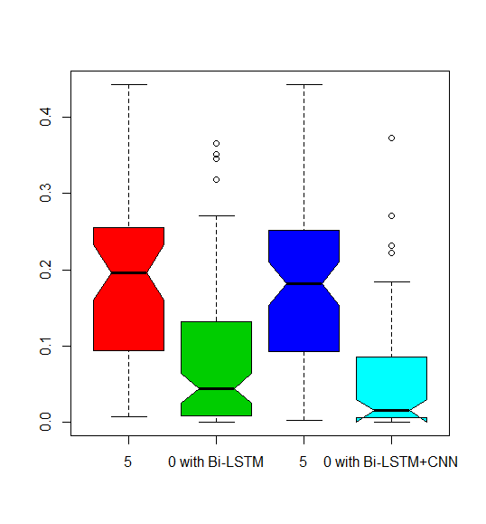

# codon_optimization_paddle
This is a trial work to codon optimization by using deep learning algorithm based on PaddlePaddle

Codon optimization is always an important task in recombinant expression applications. Previously, we have tested many different ideas trying to facilitate this work. Although some progresses have been made, such as codon online optimization platform, we still want to see whether there is other possibility to further improve it. We have some thoughts regarding this problem, e.g., 
1)	A number of data which contains gene sequence, semi-quantitative expression value under the same criterion could be available (Bole G et al, Codon influence on protein expression in E. coli correlates with mRNA levels. Nature. 2016)
2)	Expert knowledge based feature defining could not provide us good prediction on new case
3)	Deep learning could learn features from data and capture nonlinear dependencies in the sequence and interaction effects and span wider sequence context at multiple genomic scales
4)	Deep learning gets better with more data than traditional machine learning techniques 

Therefore, as a first step of our trial, we applied the commonly used deep learning platform in computer world to mine the potential of gene expression data. We wish to build a successful predictive model by using this powerful and state-of-art approach. Here, we select Baidu’s open sourced platform PaddlePaddle, which has a good documentation for users. Like the sentiment analysis to determine the attitude of a speaker or a writer with respect to some topics like movie comments, we hope to determine the expression level just based on the gene sequence. But different from movie comments composing one-by-one words, the sequence composition is not that intuitive. It may be deemed as of a stretch of nucleotides or codons (triple-nucleotides). After a serial of tests, codon with word embedding was selected to represent each gene sequence, and then fed into a recurrent neural network (RNN) model for training and testing. Concretely, we applied bidirectional LSTM (long short time memory) network with a softmax function to classify the expression level. RNN and LSTM are a type of neural networks that naturally handle sequential data and could be found elsewhere. Gene sequence dataset with known expression levels are split into training set and testing set randomly with ratio of 80% : 20%, and all parameters including hyper-parameters learning rate, dropout ratio and L2 regularization are set with default. 

Fig1 shows the learning curves of training and testing error rates, which indicate the model works best at Pass 8 with testing error rate ~0.63. This is much better when compared to the random guess of ~0.83 (5/6), although more efforts are still required to further improve the performance. A prediction on Fc dataset, which contains 152 N-terminal codon combinations with experimental expression values, shows that the best model could roughly classify them into two categories (Fig2). Boxplots illustrate the group with expression level 5 has a significantly larger expression value than the group with expression level 0. Together, these preliminary results bring confidence to us that deep learning method also ought to have its application in the field of codon optimization task.

We try to further improve the performance by adding the depth of neural network, or by designing different neural network architectures, for instance, text convolutional neural network (CNN), etc. However, overfitting is a main challenge when training. Strategies such as regularization, dropout, early stopping, and decreasing neural network complexities (fewer layers, fewer neurons) are tested. Additionally, considering the gene sequence could be deemed to be composed by nucleotides, codons, as well as amino acids, and all their properties are known to be related to the final protein expression level, we also add nucleotides and amino acids input layers, to implement codon input layer, to increase the prediction ability. Newly designed deep network architecture is shown below. It has three input layers, accordingly. And each layer is first connected by one word embedding layer (128 neurons), then followed by one Bi-LSTM layer (32 neurons), one convolution layer (32 neurons with length of 13, 3, 3, respectively) and one max pooling layer. Subsequently, these three layers are fully connected together (32 neurons), fed into one softmax layer (six neurons) for output. 

Below figure illustrates the newly designed model prediction. It could be found that the model prediction error rate on testing dataset has been reduced to ~58%, which is about 5 percent improvement compared to previous simple Bi-LSTM model. For 152 Fc case, we could observe similar trend. Group with prediction expression 5 has a significantly higher expression values. Although when compared to previous model, no significant improvement is achieved, the values of group with prediction expression 0 are relatively low. This implies our new model’s improvement on protein expression prediction under codon optimization.

From the above experiments, it is easily to find that the model can only discriminate expression level 5 or 0, we thus investigate the possible cause. We found that among total 6348 cases, samples with expression level 5/0 has 3727, which accounts for 3727/6348 = 58.7%. This leads to relative less samples in other groups. No enough training samples, no good model prediction. Therefore, if we limit our trained model to the testing set with only 5/0 expression levels, the prediction accuracy is as high as 70.4%, much higher than 64.7% by the Bi-LSTM model. This further demonstrates our newly designed model, with 3 input layers followed by one Bi-LSTM layer, one CNN layer, and one Fc layer, has a larger potential to predict protein expression levels, based only on gene sequences and/or its translated amino acid sequences. 

## Supplementatory

### Data preparation
    ./preprocess.sh

preprocess.sh:
    
    data_dir="./data/nature_pe_comp"
    python preprocess.py -i $data_dir -m True -t False

data_dir: input data directory
preprocess.py: proprocess script

If running successfully, you will see data/pre-nature_pe in direactory as follows:

dict.txt  labels.list  test.list  test_part_000  train.list  train_part_000

* test_part_000 and train_part_000: all labeled test and train sets. Train sets have been shuffled.
* train.list and test.list: train and test file lists.
* dict.txt: dictionary generated on train sets by default.
* labels.txt: neg 0, pos 1, means label 0 is negative review, label 1 is positive review.

### Transer data to model

Define a daa provider by using PyDataProvider2 to provide training or testing data to PaddlePaddle.

    from paddle.trainer.PyDataProvider2 import *

    def hook(settings, dictionary1,dictionary2, dictionary3, **kwargs):
      settings.base_dict = dictionary1
      settings.word_dict = dictionary2
      settings.aa_dict = dictionary3
      settings.input_types = {
       "base": integer_value_sequence(len(settings.base_dict)), 
       "word": integer_value_sequence(len(settings.word_dict)),
        "aa": integer_value_sequence(len(settings.aa_dict)),
       "label": integer_value(6)
       #dense_vector(1) # linear
    }
      settings.logger.info('base dict len : %d' % (len(settings.base_dict)))
      settings.logger.info('word dict len : %d' % (len(settings.word_dict)))
      settings.logger.info('aa dict len : %d' % (len(settings.aa_dict)))

    codontable = {
    'ATA':'I', 'ATC':'I', 'ATT':'I', 'ATG':'M',
    'ACA':'T', 'ACC':'T', 'ACG':'T', 'ACT':'T',
    'AAC':'N', 'AAT':'N', 'AAA':'K', 'AAG':'K',
    'AGC':'S', 'AGT':'S', 'AGA':'R', 'AGG':'R',
    'CTA':'L', 'CTC':'L', 'CTG':'L', 'CTT':'L',
    'CCA':'P', 'CCC':'P', 'CCG':'P', 'CCT':'P',
    'CAC':'H', 'CAT':'H', 'CAA':'Q', 'CAG':'Q',
    'CGA':'R', 'CGC':'R', 'CGG':'R', 'CGT':'R',
    'GTA':'V', 'GTC':'V', 'GTG':'V', 'GTT':'V',
    'GCA':'A', 'GCC':'A', 'GCG':'A', 'GCT':'A',
    'GAC':'D', 'GAT':'D', 'GAA':'E', 'GAG':'E',
    'GGA':'G', 'GGC':'G', 'GGG':'G', 'GGT':'G',
    'TCA':'S', 'TCC':'S', 'TCG':'S', 'TCT':'S',
    'TTC':'F', 'TTT':'F', 'TTA':'L', 'TTG':'L',
    'TAC':'Y', 'TAT':'Y', 'TAA':'X', 'TAG':'X',
    'TGC':'C', 'TGT':'C', 'TGA':'X', 'TGG':'W',
    }

    @provider(init_hook=hook)
    def process(settings, file_name):
      with open(file_name, 'r') as fdata:
        for line_count, line in enumerate(fdata):
            label, comment = line.strip().split('\t\t')
            label = int(label)
            #label = float(label)
            
            num_base = len(comment)
            num_codon = len(comment)/3
            bases = [comment.lower()[i] for i in range(num_base)]
            words = [comment.lower()[i*3:(i*3+3)] for i in range(num_codon)]
            #words = comment.split()
            base_slot = [
                settings.base_dict[w] for w in bases if w in settings.base_dict
            ]
            word_slot = [
                settings.word_dict[w] for w in words if w in settings.word_dict
            ]
            aa_slot = [
                settings.aa_dict[codontable[w.upper()]] for w in words if codontable[w.upper()] in settings.aa_dict
            ]            
            if not base_slot:
                continue
            if not word_slot:
                continue
            if not aa_slot:
                continue
            yield {"base":base_slot, "word":word_slot, "aa": aa_slot,"label":label}

### Training

Define the newly designed network architecture in sentiment_net.py

    def sentiment_data(data_dir=None,
                   is_test=False,
                   is_predict=False,
                   train_list="train.list",
                   test_list="test.list",
                   dict_file="dict.txt"):
    """
    Predefined data provider for sentiment analysis.
    is_test: whether this config is used for test.
    is_predict: whether this config is used for prediction.
    train_list: text file name, containing a list of training set.
    test_list: text file name, containing a list of testing set.
    dict_file: text file name, containing dictionary.
    """
    class_dim = len(open(join_path(data_dir, 'labels.list')).readlines())
    
    if data_dir is not None:
        train_list = join_path(data_dir, train_list)
        test_list = join_path(data_dir, test_list)
        dict_file = join_path(data_dir, dict_file)

    train_list = train_list if not is_test else None
    
    codontable = {
    'ATA':'I', 'ATC':'I', 'ATT':'I', 'ATG':'M',
    'ACA':'T', 'ACC':'T', 'ACG':'T', 'ACT':'T',
    'AAC':'N', 'AAT':'N', 'AAA':'K', 'AAG':'K',
    'AGC':'S', 'AGT':'S', 'AGA':'R', 'AGG':'R',
    'CTA':'L', 'CTC':'L', 'CTG':'L', 'CTT':'L',
    'CCA':'P', 'CCC':'P', 'CCG':'P', 'CCT':'P',
    'CAC':'H', 'CAT':'H', 'CAA':'Q', 'CAG':'Q',
    'CGA':'R', 'CGC':'R', 'CGG':'R', 'CGT':'R',
    'GTA':'V', 'GTC':'V', 'GTG':'V', 'GTT':'V',
    'GCA':'A', 'GCC':'A', 'GCG':'A', 'GCT':'A',
    'GAC':'D', 'GAT':'D', 'GAA':'E', 'GAG':'E',
    'GGA':'G', 'GGC':'G', 'GGG':'G', 'GGT':'G',
    'TCA':'S', 'TCC':'S', 'TCG':'S', 'TCT':'S',
    'TTC':'F', 'TTT':'F', 'TTA':'L', 'TTG':'L',
    'TAC':'Y', 'TAT':'Y', 'TAA':'X', 'TAG':'X',
    'TGC':'C', 'TGT':'C', 'TGA':'X', 'TGG':'W',
    }

    word_dict = dict()
    aa_dict = dict()
    base_dict = dict()
    j = 0
    with open(dict_file, 'r') as f:
        for i, line in enumerate(open(dict_file, 'r')):
            word = line.split('\t')[0]
            word_dict[word] = i
            if codontable[word.upper()] not in aa_dict:
                 aa_dict[codontable[word.upper()]] = j
                 j = j + 1
    
    base_dict['g'] = 0
    base_dict['a'] = 1
    base_dict['c'] = 2
    base_dict['t'] = 3

    define_py_data_sources2(
        train_list,
        test_list,
        module="dataprovider",
        obj="process",
        args={'dictionary1': base_dict,'dictionary2': word_dict, 'dictionary3': aa_dict})

    return len(base_dict), len(word_dict), len(aa_dict), class_dim

    def bidirectional_lstm_cnn_net(input_dim1,
                           input_dim2,
                           input_dim3,
                           class_dim=2,
                           emb_dim=128,
                           fc_size=4,
                           lstm_dim=128,
                           is_predict=False):
    data1 = data_layer("base", input_dim1)
    emb1 = embedding_layer(input=data1, size=emb_dim)
    
    data2 = data_layer("word", input_dim2)
    emb2 = embedding_layer(input=data2, size=emb_dim)

    data3 = data_layer("aa", input_dim3)
    emb3 = embedding_layer(input=data3, size=emb_dim)
    
    ## nt cnn + aa cnn + codon bi-lstm + fc layer
    layer_attr = ExtraLayerAttribute(drop_rate=0.5)

    bi_lstm1 = bidirectional_lstm(input=emb1, size=lstm_dim, return_seq=True)
    dropout1 = dropout_layer(input=bi_lstm1, dropout_rate=0.5)

    bi_lstm2 = bidirectional_lstm(input=emb2, size=lstm_dim, return_seq=True)
    dropout2 = dropout_layer(input=bi_lstm2, dropout_rate=0.5)
    
    bi_lstm3 = bidirectional_lstm(input=emb3, size=lstm_dim, return_seq=True)
    dropout3 = dropout_layer(input=bi_lstm3, dropout_rate=0.5)
    
    conv_1 = sequence_conv_pool(
        input=dropout1, context_len=13, hidden_size=fc_size)
    inputs = [conv_1]

    conv_2 = sequence_conv_pool(
        input=dropout2, context_len=3, hidden_size=fc_size)
    inputs.append(conv_2)

    conv_3 = sequence_conv_pool(
        input=dropout3, context_len=3, hidden_size=fc_size)
    inputs.append(conv_3)

    fc = fc_layer(input = inputs, #[conv_1,conv_2,conv_3], 
                  size = fc_size, layer_attr = ExtraLayerAttribute(drop_rate=0.5),act=ReluActivation())

    output = fc_layer(input=fc,
                             size=class_dim,
                             act=SoftmaxActivation())

    if not is_predict:
        lbl = data_layer("label", 1)
        outputs(classification_cost(input=output, label=lbl))
    else:
        outputs(output)

Then, define parameters and create trainer for model training in trainer_config.py:

    from sentiment_net import *
    from paddle.trainer_config_helpers import *

    # whether this config is used for test
    is_test = get_config_arg('is_test', bool, False)
    # whether this config is used for prediction
    is_predict = get_config_arg('is_predict', bool, False)

    data_dir = "./data/pre-nature_pe"
    dict_dim1, dict_dim2, dict_dim3, class_dim = sentiment_data(data_dir, is_test, is_predict)

    ################## Algorithm Config #####################

    settings(
        batch_size=128,
        learning_rate=2e-3,
        learning_method=AdamOptimizer(),
        model_average=ModelAverage(0.5),
        regularization=L2Regularization(8e-2),
        gradient_clipping_threshold=25)

    #################### Network Config ######################

    bidirectional_lstm_cnn_net(input_dim1=dict_dim1,input_dim2=dict_dim2,input_dim3=dict_dim3,class_dim=class_dim, fc_size=32, lstm_dim=32, is_predict=is_predict)

Finally, training:

    ./train.sh

train.sh:

    config=trainer_config.py
    output=./model_output
    paddle train --config=$config \
             --save_dir=$output \
             --job=train \
             --use_gpu=false \
             --trainer_count=8 \
             --num_passes=200 \
             --log_period=10 \
             --dot_period=20 \
             --show_parameter_stats_period=100 \
             --test_all_data_in_one_period=1 \
             2>&1 | tee 'train.log'
    paddle usage -l train.log -e $? -n "sentiment_train" >/dev/null 2>&1

If the run succeeds, the output log is saved in path of demo/sentiment/train.log and model is saved in path of model_output/. The output log is explained as follows.

> I0526 10:38:13.902485 95450 TrainerInternal.cpp:165]  Batch=10 samples=1280 AvgCost=1.72904 CurrentCost=1.72904 Eval: classification_error_evaluator=0.728906  CurrentEval: classification_error_evaluator=0.728906 

> I0526 10:38:44.678020 95450 TrainerInternal.cpp:165]  Batch=20 samples=2560 AvgCost=1.69531 CurrentCost=1.66159 Eval: classification_error_evaluator=0.725391  CurrentEval: classification_error_evaluator=0.721875 

> I0526 10:39:15.359201 95450 TrainerInternal.cpp:165]  Batch=30 samples=3840 AvgCost=1.66931 CurrentCost=1.61731 Eval: classification_error_evaluator=0.723958  CurrentEval: classification_error_evaluator=0.721094 

> I0526 10:39:44.219265 95450 TrainerInternal.cpp:165]  Batch=40 samples=5078 AvgCost=1.65918 CurrentCost=1.62776 Eval: classification_error_evaluator=0.725876  CurrentEval: classification_error_evaluator=0.731826 
> I0526 10:39:44.219666 95450 TrainerInternal.cpp:181]  Pass=0 Batch=40 samples=5078 AvgCost=1.65918 Eval: > classification_error_evaluator=0.725876 
> I0526 10:40:04.531482 95450 Tester.cpp:115]  Test samples=1270 cost=1.62236 Eval: classification_error_evaluator=0.7 
> I0526 10:40:04.538769 95450 GradientMachine.cpp:63] Saving parameters to ./model_output/pass-00000

* Batch=xx: means passing xx batches.
* samples=xx: means passing xx samples.
* AvgCost=xx: averaged cost from 0-th batch to current batch.
* CurrentCost=xx: current cost of latest log_period batches.
* Eval: classification_error_evaluator=xx: means classfication error from 0-th batch ro current batch.
* CurrentEval: classification_error_evaluator: current classfication error of the lates log_period batches.
* Pass=0: Going through all training set one time is called one pass. 0 means going through training set first time.

### Testing

Testing means evaluating the labeled validation set using the trained model.

    ./test.sh

    function get_best_pass() {
      cat $1  | grep -Pzo 'Test .*\n.*pass-.*' | \
      sed  -r 'N;s/Test.* classification_error_evaluator=([0-9]+\.[0-9]+).*\n.*pass-([0-9]+)/\1 \2/g' |\
      sort -n | head -n 1
    }

    log=train.log
    LOG=`get_best_pass $log`
    LOG=(${LOG})
    evaluate_pass="model_output/pass-${LOG[1]}"

    echo 'evaluating from pass '$evaluate_pass

    model_list=./model.list
    touch $model_list | echo $evaluate_pass > $model_list
    net_conf=trainer_config.py
    paddle train --config=$net_conf \
             --model_list=$model_list \
             --job=test \
             --use_gpu=false \
             --trainer_count=4 \
             --config_args=is_test=1 \
             2>&1 | tee 'test.log'
    paddle usage -l test.log -e $? -n "sentiment_test" >/dev/null 2>&1

### Prediction

predict.py provides a predicting interface:

    ./predict.sh

predict.sh:

    model=model_output/pass-00024/
    config=trainer_config.py
    label=data/pre-nature_pe/labels.list
    cat ./data/nature_pe/train/2/dna_2.txt | python predict.py \
     --tconf=$config\
     --model=$model \
     --label=$label \
     --dict=./data/pre-nature_pe/dict.txt \
     --batch_size=1

* predict.py: predicting interface.
* -n $config : set network configure.
* -w $model: set model path.
* -b $label: set dictionary about corresponding relation between integer label and string label.
* -d data/pre-imdb/dict.txt: set dictionary.
